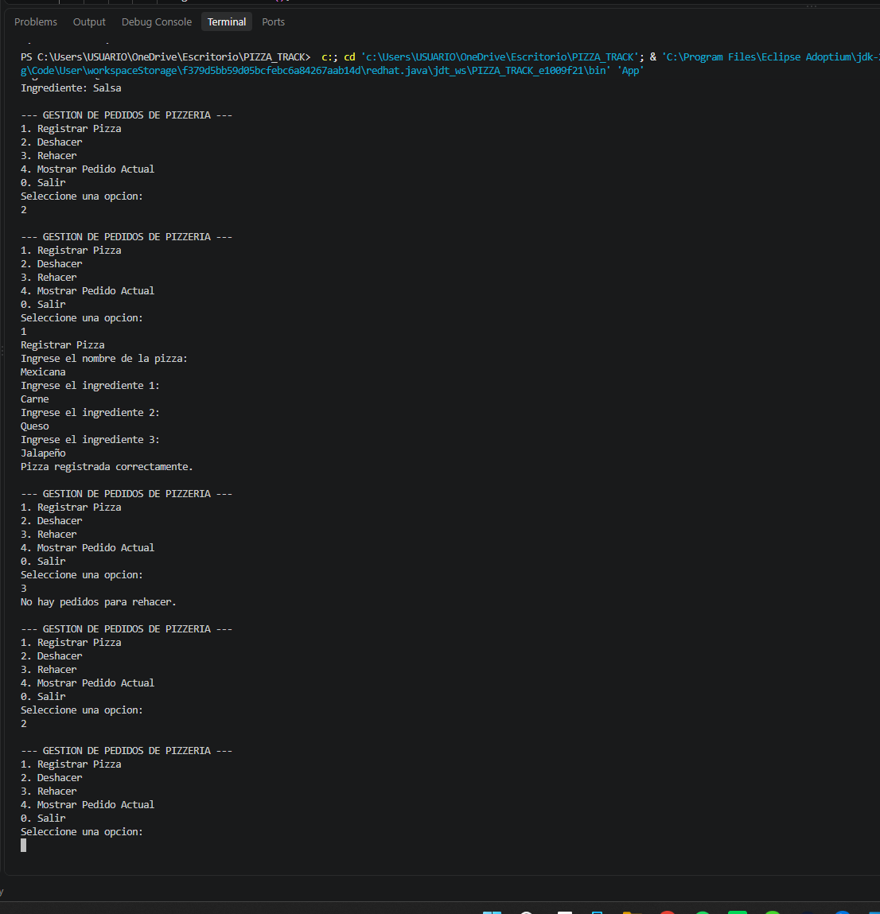

# Gestión de Pedidos de Pizzería

## Objetivo

Desarrollar una aplicación en Java para gestionar pedidos de una pizzería mediante pilas implementadas manualmente utilizando nodos y listas enlazadas.

La aplicación permite registrar pizzas, deshacer pedidos, rehacer pedidos y consultar el pedido actual.

## Descripción del proyecto

El proyecto utiliza dos pilas:

- **Pila principal:** almacena los pedidos activos y permite realizar la operación Deshacer.
- **Pila secundaria:** almacena temporalmente los pedidos deshechos y permite realizar la operación Rehacer.

Cada pizza contiene un nombre y un arreglo fijo de tres ingredientes.

La pila fue implementada manualmente mediante nodos, sin utilizar `java.util.Stack`.

## Tecnologías utilizadas

- Java
- Eclipse Temurin JDK 21
- Visual Studio Code
- Git
- GitHub

## Estructura del proyecto

```text
PIZZA_TRACK
│
├── App.java
├── Pizza.java
├── Nodo.java
├── Pila.java
├── GestionPedidos.java
└── README.md
```

## Funcionamiento

### Opción 1: Registrar Pizza

Permite registrar una nueva pizza.

El usuario ingresa el nombre de la pizza y tres ingredientes.

La pizza se guarda en la pila principal utilizando `push()`.

### Opción 2: Deshacer

Retira el último pedido de la pila principal utilizando `pop()`.

La pizza deshecha pasa a la pila secundaria para poder recuperarla.

### Opción 3: Rehacer

Recupera la última pizza que fue deshecha.

La pizza se retira de la pila secundaria y vuelve a la pila principal.

### Opción 4: Mostrar Pedido Actual

Muestra la pizza que está actualmente en la cima de la pila utilizando `peek()`.

La pizza no se elimina de la pila.

### Opción 0: Salir

Finaliza la ejecución del programa.

## Evidencia de ejecución

Captura de pantalla de la ejecución del programa en consola.



## Video de sustentación

[Ver video de sustentación:](https://drive.google.com/file/d/1bHhjFK6OCuFEVJj86g6mbBBt1vIQttQU/view?usp=sharing)

## Repositorio

Repositorio público de GitHub:

https://github.com/J4nus29/PIZZA_TRACK